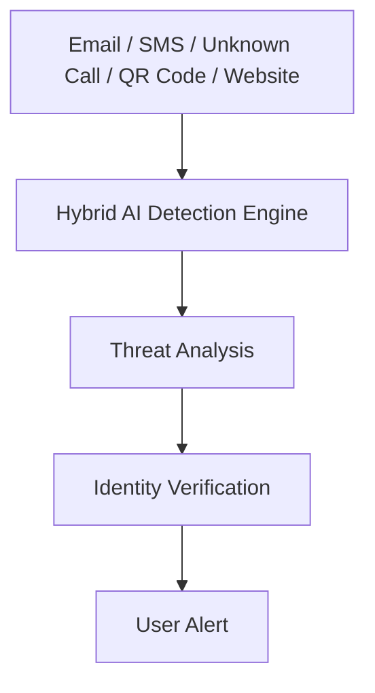
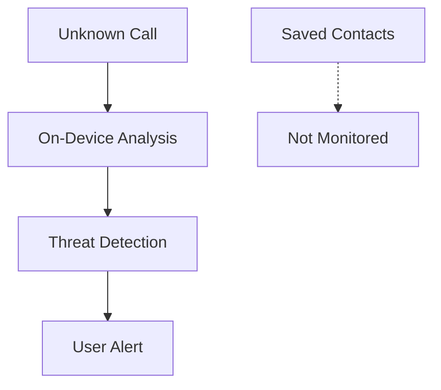
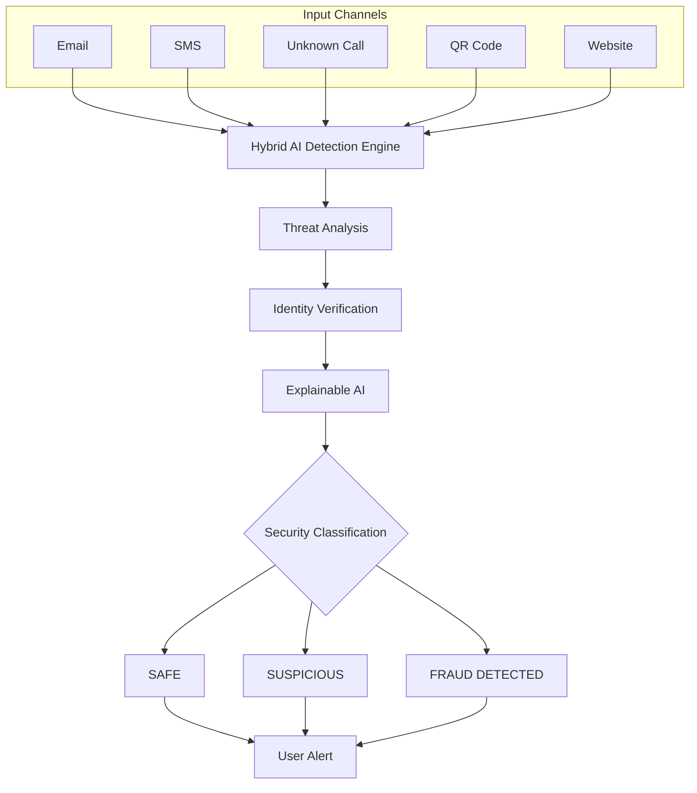

<div align="center">

# 🛡️ SENTINEL ONE

### One Guardian. Every Digital Threat.

A privacy-first **Hybrid AI Detection Engine** that proactively identifies digital fraud across email, SMS, calls, QR codes, and websites — before a user ever clicks, scans, answers, or pays. Built to shift digital security from reactive cleanup to proactive prevention.


[🚀 Explore the Project](https://github.com/rarundhathi94-cloud/SENTINEL-ONE/tree/main) · [📖 Documentation](YOUR_DOCUMENTATION_LINK) · [🎥 Demo]([YOUR_DEMO_LINK](https://youtu.be/5sdUdP-O720?si=cCmNKOvJC6WvrWLX))

</div>

---

## 📌 Project at a Glance

| Category | Details |
|---|---|
| **Project** | SENTINEL ONE |
| **Tagline** | One Guardian. Every Digital Threat. |
| **Domain** | Cybersecurity + Artificial Intelligence |
| **Approach** | Hybrid AI Detection |
| **Focus** | Proactive Digital Fraud Protection |
| **Privacy Model** | Privacy-First / On-Device Analysis |
| **Team** | Axion |
| **Members** | Harshini R, Abinaya S, Arundhathi R, N Anuja, Dhaarani R |
| **Category** | Hackathon Project — Cybersecurity & AI |

---

## 🚨 The Problem

Digital fraud reaches users through several channels at once, and today's security is largely **reactive** — it responds only after the damage is done. SENTINEL ONE targets five recurring attack surfaces:

| Threat | Description |
|---|---|
| 📧 Fraud Emails | Trick users into revealing sensitive information |
| 📱 Scam SMS | Malicious links or false urgency |
| 🌐 Fake Banking Websites | Clone portals built to steal credentials |
| 📷 Malicious QR Codes | Redirect victims to fraudulent payment pages |
| 📞 Unknown Scam Calls | Identity theft or financial fraud attempts |

By the time a reactive system flags a threat, the user may have already clicked, scanned, answered, or paid. SENTINEL ONE closes that gap.

```
Traditional Security                 SENTINEL ONE
──────────────────────               ──────────────────────
User interacts with threat           Detect
        ↓                                ↓
   Fraud occurs                       Verify
        ↓                                ↓
 Security responds                     Alert
                                          ↓
                                       Protect
```

---

## 💡 Our Solution

SENTINEL ONE is a **unified intelligent security platform** that brings together detection for every major digital fraud channel under one system, following a single consistent cycle:

<div align="center">

**Detect → Verify → Alert → Protect**

</div>

The goal is simple: protect users **before** they click a suspicious link, scan an untrusted QR code, answer a scam call, or complete a fraudulent payment.

---

## ⚙️ How SENTINEL ONE Works



Every incoming item — regardless of channel — passes through the same pipeline: the Hybrid AI Detection Engine analyzes it for signs of fraud, an identity verification step confirms the legitimacy of the sender or source, and a clear alert is generated so the user can safely decide how to proceed.

---

## 🧠 Hybrid AI Detection Engine

Instead of relying on a single AI model, SENTINEL ONE combines multiple, purpose-fit technologies:

- Artificial Intelligence
- Machine Learning
- Natural Language Processing (NLP)
- Computer Vision
- Optical Character Recognition (OCR)
- Speech Keyword Detection
- URL Reputation Analysis
- Phishing Detection Engine
- Cloud Threat Intelligence
- Explainable AI

**Technology Mapping**

| Technology | Application |
|---|---|
| NLP | Email & SMS Analysis |
| Computer Vision + OCR | QR Verification |
| URL Reputation Analysis | Website Verification |
| Speech Keyword Detection | Unknown Call Detection |

---

## 🛰️ Multi-Channel Protection

<details>
<summary>📧 <b>Email Protection</b></summary>
<br>
Analyzes incoming email content using NLP to detect phishing keywords, fake banking URLs, and urgency-based social engineering before a link is ever clicked.
</details>

<details>
<summary>📱 <b>SMS Protection</b></summary>
<br>
Scans SMS content for scam indicators such as unknown senders, shortened URLs, and phishing language patterns.
</details>

<details>
<summary>🌐 <b>Website Protection</b></summary>
<br>
Verifies banking website URLs to identify fake or cloned domains and flags sites impersonating legitimate financial institutions.
</details>

<details>
<summary>📷 <b>QR Protection</b></summary>
<br>
Uses Computer Vision and OCR to verify payment QR codes, checking for merchant legitimacy and QR-replacement style attacks before a payment is made.
</details>

<details>
<summary>📞 <b>Unknown Call Protection</b></summary>
<br>
Applies speech keyword detection to unknown or unsaved numbers only, identifying scam patterns such as OTP, PIN, KYC, or remote-access requests — while saved contacts are never monitored.
</details>

---

## 📊 Detection Results

| Result | Status | Reason | Recommended Action |
|---|---|---|---|
| 🟢 **SAFE** | Verified Source | Trusted sender or website | Safe to continue |
| 🟡 **SUSPICIOUS** | Potential Risk | Unverified source or unusual activity | Verify before proceeding |
| 🔴 **FRAUD DETECTED** | High Risk | Known phishing or scam indicators | Block immediately and report |

---

## 🔐 Privacy-First Architecture

Privacy is a core design principle, not an afterthought:

- Only incoming calls from **unknown or unsaved** numbers are analyzed
- **Saved contacts are never monitored**
- Analysis happens **completely on-device**
- **Conversations are never stored or uploaded**



---

## 🔎 Explainable AI

SENTINEL ONE doesn't just output a risk label — it aims to make every alert **understandable**. Rather than showing a bare risk score, the system is designed to surface the *reasons* behind a SAFE, SUSPICIOUS, or FRAUD DETECTED classification (e.g. "phishing keywords detected," "fake banking URL found," "unverified merchant"), so users can trust and act on the result with confidence.

> No specific explainability algorithm is claimed beyond this design intent, pending further implementation.

---

## 🧪 Prototype

The prototype demonstrates the end-to-end SENTINEL ONE workflow across the following screens:

- Dashboard
- Unknown Call Detection
- Email Analysis
- SMS Analysis
- QR Verification
- Website Verification
- Final Security Alert Dashboard

**Dashboard Features**
- Real-time threat score
- AI recommendations
- Risk level indicator
- Explainable alerts
- Security history

<div align="center">

| Dashboard | Email Analysis | SMS Analysis |
|---|---|---|
| `
` | `
` | `
` |

| QR Verification | Website Verification | Call Detection |
|---|---|---|
| `
` | `
` | `
` |

</div>

> 📌 Screenshot paths above are placeholders — add the actual prototype images to an `assets/` folder for them to render.

---

## 🏗️ System Architecture



---

## 🥇 Competitive Advantage

| Traditional Security | SENTINEL ONE |
|---|---|
| Password Protection | Hybrid AI Detection |
| OTP Verification | Privacy-First Design |
| Manual Verification | Multi-Channel Detection |
| Reactive Security | Proactive Prevention |
| No QR Protection | QR Code Detection |
| Limited Website Detection | Website Protection |
| Limited Email Security | Email Protection |
| Limited SMS Security | SMS Protection |
| No Scam Call Detection | Scam Call Detection |
| Limited AI Explanation | Explainable AI |

<div align="center">

**"One intelligent platform protecting every digital banking channel."**

</div>

---

## 🎯 Target Users

- Banks
- FinTech Companies
- UPI Users
- Digital Banking Customers
- Senior Citizens
- Government Financial Services

---

## 🔭 Future Scope

> The items below are **proposed future work**, not currently implemented features.

- Regional Language Scam Detection
- Voice Biometrics
- Bank API Integration
- Dark Web Identity Monitoring
- Cross-Platform Protection
- Real-Time Fraud Intelligence

---

## 📁 Project Structure

Repository structure will be updated as implementation files are added.

---

## 🚀 Getting Started

At the current stage, SENTINEL ONE is presented as a prototype/concept implementation (an interactive front-end mockup of the detection dashboard and analysis flows). Setup and installation instructions will be added as the implementation is expanded.

---

## 🎥 Demo

> [Demo link coming soon](https://youtu.be/5sdUdP-O720?si=cCmNKOvJC6WvrWLX).

---

## 📚 Documentation

- Project Summary — `YOUR_DOCUMENTATION_LINK`
- Presentation — `YOUR_DOCUMENTATION_LINK`
- Architecture — `YOUR_DOCUMENTATION_LINK`
- Demo — `[YOUR_DEMO_LINK]([https://youtu.be/5sdUdP-O720?si=cCmNKOvJC6WvrWLX](https://youtu.be/5sdUdP-O720?si=cCmNKOvJC6WvrWLX))`

---

## 🗺️ Roadmap

- [x] Multi-channel threat detection concept
- [x] Hybrid AI architecture
- [x] Privacy-first design
- [x] Prototype interface
- [ ] Regional language detection
- [ ] Voice biometrics
- [ ] Bank API integration
- [ ] Cross-platform protection
- [ ] Real-time fraud intelligence

---

## 👥 Team — Axion

| Member | Role |
|---|---|
| Arundhathi R | Team Leader |
| Abinaya S | Team Member |
| Harshini R | Team Member |
| N Anuja | Team Member |
| Dhaarani R | Team Member |

---

## ⚠️ Disclaimer

SENTINEL ONE is a hackathon/project prototype focused on demonstrating a proactive, privacy-first approach to digital fraud detection. It should not be presented as a production-grade banking security system unless and until the necessary validation, testing, security audits, and integrations have been completed.

---

## 📄 License

License: MIT License.

---

<div align="center">

## 🛡️ SENTINEL ONE

### One Guardian. Every Digital Threat.

**"Detect. Verify. Alert. Protect."**

*Team Axion*

</div>
